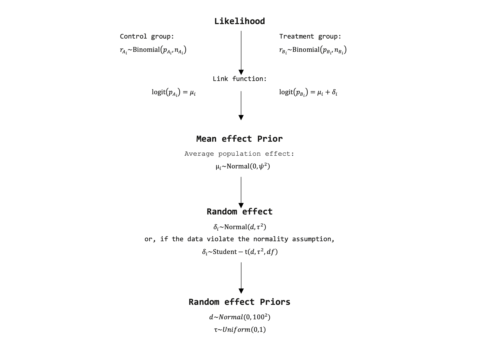

```{r setup, include = TRUE, message = FALSE}
knitr::opts_chunk$set(echo = TRUE, fig.height = 6, fig.width = 10)
# load libraries
pkgs <- c("tidyr", "ggplot2", "rstan", "bayesplot", "parallel", "loo", 
          "readxl")
sapply(pkgs, require, character.only = TRUE)
# set number of default cores
options(mc.cores = detectCores())
# set plot theme
theme_set(theme_minimal()) 
# set colour scheme
color_scheme_set("blue")
```

**Note: this is the contents page. The assignment starts on the following page.**\
\newpage  

#  1. Introduction
This project is motivated by a thesis I finished in 2020. The thesis included a pairwise meta-analysis to estimate the efficacy of the Bivalent Human Papillomavirus vaccine. It was originally coded in JAGS, did not have any proper priors, did not include coefficients, and it was used to inform a fully-integrated Bayesian health economics model. The original JAGS model was coded as:


```
# likelihood and prior. Model parameters are abbreviated by .vac.
  for (i in 1:Nstud.vac) {
    # Likelihood:
     rA.vac[i] ~ dbin(pA.vac[i], nA.vac[i])
     rB.vac[i] ~ dbin(pB.vac[i], nB.vac[i])

    # Logistic link function:
     logit(pA.vac[i]) <- mu.vac[i]
     logit(pB.vac[i]) <- mu.vac[i] + delta.vac[i]
    
    # Average effect prior for SUB-MODEL 2:
     mu.vac[i] ~ dnorm(0, 1e-4)
    # Prior for sub-model 2 (Random. pop. effect):
     delta.vac[i] ~ dt(psi.vac, prec.vac, 1) 
     # if desired can be ~ dnorm(psi.vac, prec.vac)
    
     ### Mixed predictive check for SUB-MODEL 2:
       # Predictive likelihood:
        rA.mxd[i] ~ dbin(pA.new[i], nA.vac[i])
        
       # Predictive logit link function:
        logit(pA.new[i]) <- mu.vac[i] + delta.new
               
       # Mixed predictve p-value:
        pA.mxd[i] <- step(rA.mxd[i] - rA.vac[i]) - 0.5 * equals(rA.mxd[i], rA.vac[i])
```

Since finishing the thesis, I have wanted to redo the meta-analysis in Stan. Note that this project won't, however, include the economic model. Please see a simple illustration of the model below (note that some of the final model assumptions may differ).

<center>

<center>

Given the above motivation, I will therefore implement the original model in Stan and include proper priors, which will be given logical boundaries when necessary. Coefficients will also be included where applicable. I will also compare grouped and hierarchical models.

\newpage  
##  1.2 Data
The data for the model are printed below. Note that references for each input can be found in the original Excel file.
```{r data, include = TRUE}
# load data
df <- read_excel("data/data_vaccine_case_control.xlsx")
# print data frame
df
```

We can then prepare the data for Stan as follows:
```{r data prep, include = TRUE}
# n studies
n_s <- nrow(df)
# n_arms number of arms
n_arms <- 2
# y events in j'th arm
y <- matrix(df$y_vaccine, df$y_control, ncol = n_arms, nrow = n_s)
# n observations in j'th arm
n <- matrix(df$n_vaccine, df$n_control, ncol = n_arms, nrow = n_s)
# data list
data_list <- list(n_s = n_s, n_arms = n_arms, y = y, n = n)
```
## 1.3 Stan model
Rewriting the JAGS code in Stan results in the following:

## 1.4 Running the model
```{r vaccine hierarchical model, include = FALSE, echo = FALSE}
# initiate simulation
factory_hrchl <- stan(file = "stan/project_stan.stan", data = data_list,
                    pars = c("delta"), chains = 1)
```
```{r hierarchical print, include = TRUE}
# print results
factory_hrchl
```

# 2. Analysis


